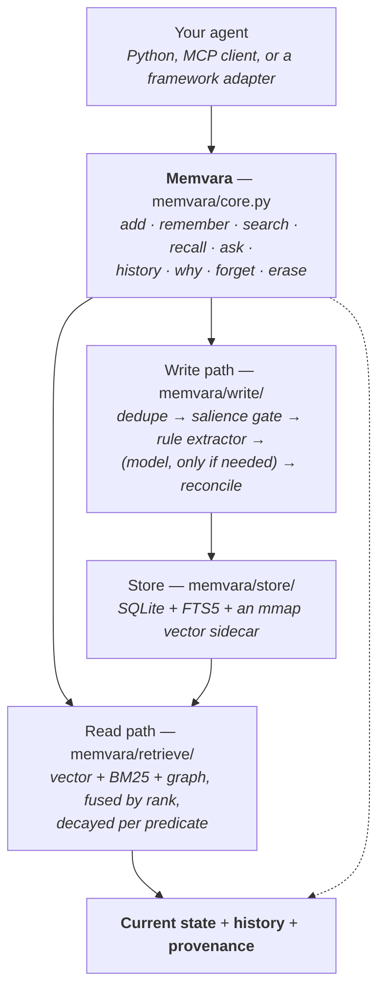

<h1 align="center">Memvara</h1>

<p align="center">
  <b>Bitemporal memory for AI agents.</b><br/>
  Know what was true. Know when it was true. Know why you believe it.
</p>

<p align="center">
  <a href="https://pypi.org/project/memvara/"></a>
  <a href="https://pypi.org/project/memvara/"></a>
  <a href="https://github.com/memvara/memvara/blob/main/LICENSE"></a>
  <a href="https://github.com/memvara/memvara/actions/workflows/ci.yml"></a>
  <a href="https://memvara.dev"></a>
</p>

```python
mem.remember("Alice", "lives_in", "Berlin",   valid_from=jan)
mem.remember("Alice", "lives_in", "London",   valid_from=mar)
mem.remember("Alice", "lives_in", "New York", valid_from=jun)

[c.object for c in mem.get_all()]              # ['New York']   where now?
[c.object for c in mem.get_all(as_of=mar_20)]  # ['London']     and on 20 March?
[c.object for c in mem.get_all(as_of=jan_20)]  # ['Berlin']     and on 20 January?
```

Three questions, three different correct answers, no model call. A store that keeps one
value per fact answers the first and gets the other two wrong — not by hallucinating, but
because overwriting Berlin destroyed the only record that Berlin was ever the answer.

```bash
pip install memvara
```

**numpy and nothing else.** Runs offline, no API key, no Docker, no vector database.

---

## The problem

AI agents don't just forget. **They remember the wrong thing.**

A customer emails in March: *"We've moved. Invoices go to Bramble Cottage from now on,
not Coldharbour Road."* You store it. In August the same customer writes again, annoyed:
*"An invoice went to Coldharbour Road again."*

Now ask the store where invoices go. It holds two messages, both mentioning the customer
and an address, and it ranks them by similarity. The August message is more recent and
says *Coldharbour Road* twice. A reasonable retriever puts it first, the agent reads it,
and the customer gets a third wrong invoice.

**That is not the model hallucinating.** The memory layer held both answers and marked
neither one current. It had no way to: nothing in "an embedding and an `updated_at`
column" can represent *this value replaced that one in March*.

Retrieval asks one question — *what is relevant?* Memory has to answer five:

> *What do I know?* · *When was it true?* · *When did I learn it?* ·
> *What replaced it?* · *Why do I believe it?*

Memvara answers all five **structurally**, which means none of them costs a model call.
A contradiction is an indexed lookup. A historical query is a range condition on two
columns. Provenance is a join.

---

## The 90-second demo


```bash
pip install memvara
git clone https://github.com/memvara/memvara && cd memvara
python3 examples/temporal_memory_demo/demo.py
```

Six beats: the problem, three writes, what is true now, what was true then, the record
behind both answers, and the close. Ninety seconds, held to a published schedule rather
than to whatever its pauses happen to add up to. It runs against a real store with no key
and no network — every value on screen is read back out of it.

`--fast` removes the pauses and changes nothing else, which is why the transcript is a
[golden file](https://github.com/memvara/memvara/blob/main/examples/temporal_memory_demo/expected-output.txt) the test suite asserts
on. The GIF above is not checked in either: it is a build product, recorded by CI from
this repository and attached to each release, so the URL never changes and the image
never goes stale. [How it is recorded](https://github.com/memvara/memvara/blob/main/examples/temporal_memory_demo/README.md), including
the deterministic replay that makes the same source produce the same bytes.

---

## Quickstart

```bash
pip install memvara
```

```python
from datetime import datetime, timezone
from memvara import Memvara, NullLLM

UTC = timezone.utc
def at(m, d): return datetime(2026, m, d, tzinfo=UTC)

mem = Memvara("memory.db", user="alice", llm=NullLLM())

mem.remember("Alice", "lives_in", "Berlin",
             valid_from=at(1, 10), recorded_at=at(1, 10))
mem.remember("Alice", "lives_in", "London",
             valid_from=at(3, 15), recorded_at=at(3, 15))
mem.remember("Alice", "lives_in", "New York",
             valid_from=at(6, 2), recorded_at=at(6, 2))

[c.object for c in mem.get_all()]                  # ['New York']
[c.object for c in mem.get_all(as_of=at(3, 20))]   # ['London']
[c.object for c in mem.get_all(as_of=at(1, 20))]   # ['Berlin']

[r.text for r in mem.search("where does Alice live?")]
# ['Alice lives in New York']
```

Two dates per fact, because they answer different questions. **`valid_from` is when it
became true in the world; `recorded_at` is when this store was told.** They are equal here
because Alice told us on the day she moved — a fact that arrives late about the past is
where they differ, and that is the case a single `updated_at` column cannot represent.

That is [`examples/temporal_memory.py`](https://github.com/memvara/memvara/blob/main/examples/temporal_memory.py), which the test suite
runs and asserts on. Full walkthrough:
[Quickstart](https://github.com/memvara/memvara/blob/main/docs/getting-started/quickstart.md).

### Or hand it the conversation

```python
mem.add("I live in Berlin and work at Acme")
mem.add("Actually, I moved to Lisbon last month")

[r.text for r in mem.search("where do they live?")][:1]
# ['user lives in Lisbon']

[(c.object, c.state) for c in mem.history("user", "lives_in")]
# [('Berlin', 'ended'), ('Lisbon', 'live')]
```

`add()` takes a string, a list of strings, pre-built `Episode`s, or OpenAI/mem0-style
`{"role": ..., "content": ...}` transcripts, so an existing agent loop can pass its
messages straight through. It runs three model-free tiers first — hash dedupe,
near-duplicate detection, a salience gate and a rule-based extractor — and batches
whatever survives into a single model call.

**With no `llm=` configured there is no model tier at all**, so the two sentences above
work (they are recognised forms) and an employer mentioned in passing does not. Dropped
turns are counted on `WriteReceipt.unextracted` and the constructor warns once. That is the
qualifier on the offline claim: the library runs with no API key; extraction from arbitrary
prose does not. `remember()` is the offline way to get the full machine, and it is what a
real integration does.

### Other ways in

<table>
<tr><td width="50%" valign="top">

**In your editor** — nothing to install, nothing to run.

```
/plugin marketplace add memvara/claude-memvara
/plugin install memvara
```

Cursor, Codex, Grok, VS Code and OpenCode have their own one-liners at
[memvara.dev/docs/agents](https://memvara.dev/docs/agents). Claude Desktop and ChatGPT
paste the same URL.

</td><td width="50%" valign="top">

**On your own machine** — a file you control.

```bash
MEMVARA_DB=~/memory.db memvara-mcp
memvara-mcp init --agent claude
```

JSON-RPC 2.0 over stdio, fourteen tools, no SDK dependency.
[MCP](https://github.com/memvara/memvara/blob/main/docs/integrations/mcp.md) · [Deploying](https://github.com/memvara/memvara/blob/main/docs/DEPLOY.md)

</td></tr>
<tr><td colspan="2" valign="top">

**From your own code, against a hosted store** — `pip install 'memvara[cloud]'`

```python
mem = Memvara(api_key="mv_…", user="alice")     # or Memvara.connect()
```

The same methods, served by a hosted `/v1` API instead of a local store, with every
response hydrated back into the same dataclasses — a function that takes a `Memvara` and
calls `search()` cannot tell which it was handed. A bare `Memvara()` **never** becomes
remote: the dispatch reads the explicit `api_key=` or `base_url=` argument and never the
environment, so a script that has always written to a local file cannot start posting to a
hosted store because somebody ran `memvara-mcp login` on that machine.
[A hosted deployment](https://github.com/memvara/memvara/blob/main/docs/API.md#a-hosted-deployment)

</td></tr>
</table>

---

## Why Memvara

| | |
|---|---|
| 🕰️ **Two clocks, not one** | When it was true, and when you learned it — independently. Ask what you believed in March about June and get an answer, not a guess. |
| ⚖️ **Contradictions resolve without a model** | Cardinality is a schema property, so a conflict is an indexed lookup. Same two facts, same result, every run. |
| 🧾 **Nothing is silently lost** | A superseded fact is *ended*, never deleted, and every write returns a receipt saying what it did — including what it could *not* extract. |
| 🔍 **Retrieval that explains itself** | Vector and BM25 fused by rank, decayed per predicate, and every score inspectable rather than a ranking you have to trust. |
| 🗣️ **It answers the audit question in words** | `ask()` gives what is true now, what was true then, and what this store *would have told you* then — plus the day the record changed. No model composes it. |
| 🛡️ **A guess cannot quietly overwrite a statement** | A value worth less than half of what it would replace is kept beside it, and the receipt names both. Overwriting would record that the world changed, when nothing had. |
| 🧬 **Claims are a graph** | Walk relationships at a point in time — and optionally fuse that walk into search as a third retrieval leg. |
| 🔌 **Offline by default** | numpy and nothing else. No API key, no Docker, no vector database, no network on the write path. |

Longer form: [Why Memvara?](https://github.com/memvara/memvara/blob/main/docs/concepts/why-memvara.md)

---

## Temporal memory

Two axes means two clocks, and they move independently:

```python
mem.get_all(valid_at=T)   # what we believe TODAY about how the world was at T
mem.get_all(known_at=T)   # what we believed at T, about the world as it is now
mem.get_all(as_of=T)      # both clocks at T — what we believed at T, about T
```

The middle two are the ones a single instant cannot ask. A correction that arrives in
August about June is invisible to `as_of=June`, because that call rewinds the belief clock
past the correction; `valid_at=June` is how you see it. `as_of` is exact sugar for
`valid_at=known_at=T`, and passing it alongside either axis raises rather than quietly
picking one.

Every read takes all three — `search`, `get_all`, `count`, `history`, `why`, `produced`,
`neighborhood`, `paths_between`.

`ask()` composes the difference into an answer, which is the question the two clocks exist
for:

```python
mem.ask("where do they live?", at=datetime(2026, 3, 15, tzinfo=utc)).text

# user lives_in: Berlin.
#   On 2026-03-15 this store would have said Rome, and that is what anyone acting
#   on it then acted on. The difference was recorded 2026-03-22, 7 days after the
#   instant you asked about.
```

Three readings of every fact it touches — what is true now, what we believe today was true
then, and what this store *would have answered* then. The last two differing means the
record was corrected after the moment you asked about, so the answer somebody acted on is
not the answer they would get today. **No model is consulted**; every sentence is rendered
from a stored column.

[Bitemporal memory](https://github.com/memvara/memvara/blob/main/docs/concepts/bitemporal-memory.md) ·
[Temporal retrieval](https://github.com/memvara/memvara/blob/main/docs/concepts/temporal-retrieval.md)

---

## Contradiction resolution

```python
mem.remember("Alice", "lives_in", "Berlin")
mem.remember("Alice", "lives_in", "Lisbon")

[c.object for c in mem.get_all()]
# ['Lisbon']

[(c.object, c.state) for c in mem.history("Alice", "lives_in")]
# [('Berlin', 'ended'), ('Lisbon', 'live')]
```

Three steps, none of which involves a model. **The predicate is normalised** — `lives_in`,
`resides_in`, `based_in` and `moved_to` are one slot. **The entity is folded** —

```python
from memvara import entity_key
entity_key("Acme Corp.") == entity_key("ACME, Inc.") == entity_key("acme")   # True
```

— which is what makes the keyed lookup fire at all. **Then cardinality decides**:
`lives_in` is declared single-valued, so the new value closes the old one's interval.

The alternative design — embed, retrieve the nearest existing memories, ask a model
whether they conflict — fails two ways that have nothing to do with model quality. It can
**miss** (the conflicting value need not fall in top-k, and then both stay live), and it is
**not repeatable** (the same two facts can resolve differently on two runs, with nothing
downstream able to tell).

### Teach it your vocabulary

The built-in predicates are a personal-assistant vocabulary — where someone lives, where
they work. **A store of engineering facts matches none of them**, and an unknown predicate
takes the safe default twice over: multi-valued, so nothing supersedes, and slow-decaying,
so this morning's deploy still ranks as fresh in two years.

```bash
MEMVARA_PREDICATES=engineering memvara-mcp        # or: engineering,decisions,./ours.toml
```

```toml
[[predicate]]
name = "git_state"
cardinality = "one"     # supersedes; "many" accumulates
volatility = "fast"     # static | slow | fast -> 36500 | 730 | 7 day half-life
```

A declaration outranks a guess, so a pack corrects a store that already classified
something wrongly rather than only shaping a fresh one.

[Contradiction resolution](https://github.com/memvara/memvara/blob/main/docs/concepts/contradiction-resolution.md)

---

## Provenance

```python
turn = mem.add("Decision: migrate auth from API keys to OAuth 2.0.",
               role="system", ts=jun)
mem.remember("checkout-service", "auth_strategy", "OAuth 2.0",
             sources=turn.episode_ids, valid_from=jun, recorded_at=jun)

p = mem.why(claim_id)
[e.text for e in p.episodes]      # ['Decision: migrate auth from API keys to OAuth 2.0.']
[c.text for c in p.superseded]    # ['checkout-service auth strategy API keys']
p.derivation, p.extractor         # (<Derivation.USER: 'user'>, 'api')

[c.text for c in mem.produced(turn.episode_ids[0])]   # the same link, backwards
```

The turn, not a paraphrase of it — and `superseded`, which is the field that turns a note
into a record. *"We decided X"* becomes *"we decided X on 12 June, replacing Y, on this
evidence"*, which is the sentence an incident review actually needs.

**Three words, three different events, and using the wrong one is undetectable
afterwards:**

| Word | What happened | Written by |
|---|---|---|
| **ended** | The world changed. It was true, and then it wasn't. | a superseding write, or `forget(close="ended")` |
| **retired** | The record was wrong. It was never true. | `forget()`, `delete()` — the default |
| **erased** | The text itself is gone. Not recoverable. | `erase()`, `purge()` |

*Served a value that expired* and *served a value that was never true* are one column apart
and are not the same finding. Only the third deletes anything.

[Provenance](https://github.com/memvara/memvara/blob/main/docs/concepts/provenance.md)

---

## Architecture



The write path and the read path meet only at the store, and **nothing on the read path
calls a model** — not even the optional reranker, which is a cross-encoder rather than a
generative model. History and provenance are not a separate subsystem: they fall out of
the store keeping intervals and supersession pointers instead of overwriting rows.

Everything replaceable is a protocol — `Store`, `Embedder`, `LLM`, `Redactor`, `Recorder` —
and each has a real second implementation in this repository rather than being a
hypothetical extension point.

[Architecture, in four diagrams](https://github.com/memvara/memvara/blob/main/docs/reference/architecture.md) ·
[How it works](https://github.com/memvara/memvara/blob/main/docs/DESIGN.md) · [Internals](https://github.com/memvara/memvara/blob/main/docs/INTERNALS.md)

---

## Use cases

| | |
|---|---|
| **Coding agents** | *Why are we using OAuth?* — the decision, the day it replaced API keys, and the message it came from. [Guide](https://github.com/memvara/memvara/blob/main/docs/guides/coding-agents.md) · [example](https://github.com/memvara/memvara/blob/main/examples/coding_agent.py) |
| **Support agents** | The customer corrected the address in March; the agent must not quote the old one in August. This is the corpus behind [`demo/`](https://github.com/memvara/memvara/blob/main/demo/README.md). |
| **Personal assistants** | The built-in vocabulary is this one: where somebody lives, works, what they are allergic to, and how they want to be spoken to (`memory_standing`). |
| **Research agents** | A finding that arrives late about the past is a `valid_from` in the past and a `recorded_at` of today, which is exactly what the two clocks are for. |
| **Multi-agent systems** | `tenant > user > agent > session`, with inheritance and fail-closed filters: a session sees that user's durable memory but never a sibling session's scratch space. |

```python
bob = mem.scope(user="bob")     # the whole API, with the scope bound
bob.add("I live in Oslo")
```

---

## Integrations

| | Keeps | Loses |
|---|---|---|
| **MCP** — Claude Code, Cursor, Codex, Grok, VS Code, OpenCode, Claude Desktop, ChatGPT | everything | — |
| **LangChain** `MemvaraRetriever` | everything, including `as_of=` | — |
| **LlamaIndex** `MemvaraRetriever`, `MemvaraMemoryBlock` | everything; the memory block keeps the write path too | — |
| **LangGraph** `MemvaraStore` | contradiction resolution, per-field claims | the predicate registry |
| **LangChain** `MemvaraChatMessageHistory` | the write path | supersession, intervals, source ids |
| **CrewAI** `MemvaraStorage` | storage and scope | the keyed lookup — its unit of memory has no subject or predicate |

The rule that decides it: **an interface that hands over the query text keeps everything;
one that hands over a pre-computed embedding, or a list of messages, cannot.** Each adapter
says which it is, out loud. [Frameworks](https://github.com/memvara/memvara/blob/main/docs/integrations/frameworks.md)

### Coming from somewhere else

```python
from memvara.compat import import_mem0, import_supermemory

import_mem0(mem, history_db="~/.mem0/history.db")   # replays mem0's own mutation log
import_supermemory(mem)                             # reads the Supermemory export API
```

mem0 records what changed and when, so that import rebuilds supersession and answers
`as_of` afterwards. Supermemory records current state, so its documents arrive as episodes
on their original timestamps and nothing invents a history it was never told. There is
also a method-level mem0 shim if you want its call surface on this store.

---

## Documentation

**[Start here → docs/](https://github.com/memvara/memvara/blob/main/docs/README.md)** — every page links to the next one.

| | |
|---|---|
| Getting started | [Installation](https://github.com/memvara/memvara/blob/main/docs/getting-started/installation.md) · [Quickstart](https://github.com/memvara/memvara/blob/main/docs/getting-started/quickstart.md) · [Your first memory](https://github.com/memvara/memvara/blob/main/docs/getting-started/first-memory.md) |
| Concepts | [Why Memvara?](https://github.com/memvara/memvara/blob/main/docs/concepts/why-memvara.md) · [Bitemporal memory](https://github.com/memvara/memvara/blob/main/docs/concepts/bitemporal-memory.md) · [Contradiction resolution](https://github.com/memvara/memvara/blob/main/docs/concepts/contradiction-resolution.md) · [Provenance](https://github.com/memvara/memvara/blob/main/docs/concepts/provenance.md) · [Temporal retrieval](https://github.com/memvara/memvara/blob/main/docs/concepts/temporal-retrieval.md) · [RAG and memory](https://github.com/memvara/memvara/blob/main/docs/concepts/rag-vs-memory.md) |
| Guides and integrations | [Coding agents](https://github.com/memvara/memvara/blob/main/docs/guides/coding-agents.md) · [MCP](https://github.com/memvara/memvara/blob/main/docs/integrations/mcp.md) · [Frameworks](https://github.com/memvara/memvara/blob/main/docs/integrations/frameworks.md) |
| Reference | [API](https://github.com/memvara/memvara/blob/main/docs/API.md) · [Architecture](https://github.com/memvara/memvara/blob/main/docs/reference/architecture.md) · [How it works](https://github.com/memvara/memvara/blob/main/docs/DESIGN.md) · [Internals](https://github.com/memvara/memvara/blob/main/docs/INTERNALS.md) · [Deploying](https://github.com/memvara/memvara/blob/main/docs/DEPLOY.md) |
| Also | [FAQ](https://github.com/memvara/memvara/blob/main/docs/FAQ.md) · [Benchmarks](https://github.com/memvara/memvara/blob/main/docs/BENCHMARKS.md) · [Limitations](https://github.com/memvara/memvara/blob/main/docs/LIMITATIONS.md) · [Upgrading](https://github.com/memvara/memvara/blob/main/docs/UPGRADING.md) · [Roadmap](https://github.com/memvara/memvara/blob/main/docs/ROADMAP.md) · [Open core](https://github.com/memvara/memvara/blob/main/docs/OPEN-CORE.md) |
| Examples | [Three runnable programs](https://github.com/memvara/memvara/blob/main/examples/README.md), asserted on by the suite |

---

## RAG, vector stores, and where this fits

**Memvara is not a replacement for RAG and it is not a vector database.** It uses vector
search internally, and swapping in pgvector is a protocol away.

```
RAG                                    Memory
 ↓                                      ↓
"Which documents are relevant?"        "What persistent state do I know about
                                        this entity, how has it changed, and
                                        what was true at a point in time?"
```

| | RAG | Memvara |
|---|---|---|
| Unit | a chunk of a document | a claim: `(subject, predicate, object)` |
| Addressed by | similarity to a query | the slot `(subject, predicate)` |
| Corpus | mostly static; documents are added | mostly mutable; values are replaced |
| A contradiction is | two chunks that both rank | a slot with two live values, resolved on write |
| "When" means | the document's date | two dates: when it was true, when you learned it |
| Good at | *what does the manual say about TLS errors* | *what is this customer's billing address, and what was it in March* |

They compose: **RAG answers from the corpus, memory supplies the state the corpus does not
know.** *"What is our refund window for this customer's plan?"* is two questions — which
plan they are on (one slot, one current value, with a history) and what the policy says for
that plan (a passage from a document).

Memvara ships retriever adapters for LangChain and LlamaIndex, so in an existing pipeline
it can be one more retriever rather than a separate call.
[RAG and memory](https://github.com/memvara/memvara/blob/main/docs/concepts/rag-vs-memory.md)

### Against mem0 specifically

mem0 and its descendants store a memory as an opaque string with an embedding, and every
`add()` costs a model call on the critical path. Retrieval is vector top-k.

> **Corrected against mem0 2.0.17.** An earlier version of this section said `add()` costs
> *two* LLM calls — extract, then adjudicate ADD/UPDATE/DELETE. That described mem0 1.x.
> 2.x makes **one** call, with existing memories passed into a single additive extraction
> prompt; `DEFAULT_UPDATE_MEMORY_PROMPT` is still in the source and no longer reached from
> the add path. The correction cuts against us, so it is stated rather than quietly
> dropped — but the contradiction problem it was cited for got *larger*, not smaller: 2.x's
> add path emits only `ADD` events, and its prompt says "Your sole operation is ADD".
> Conflicting values are **linked**, never retired. `update()` and `delete()` are calls
> your application has to know to make.

Four consequences that show up in production:

1. **Contradictions accumulate.** In 2.x this is explicit: nothing on the write path
   retires anything. Six months in, the store holds three cities for one person and
   returns whichever embeds closest to the question.
2. **Writes are slow and expensive.** A model call per turn, on the critical path,
   including for "ok, thanks."
3. **There is no time.** One `updated_at` column can't answer "where did she live in
   March?" or absorb a fact that arrives late about the past.
4. **Nothing explains itself.** When the agent says something wrong, you cannot ask which
   memory caused it, where that memory came from, or why it ranked first.

Memvara is built around the observation that **most of this doesn't need a model at all.**

---

## Measured

| | |
|---|---|
| Against the real `mem0ai` package | [`docs/BENCHMARKS.md`](https://github.com/memvara/memvara/blob/main/docs/BENCHMARKS.md#measured-against-the-real-mem0-package) |
| The two clocks, six question families | [`docs/BENCHMARKS.md`](https://github.com/memvara/memvara/blob/main/docs/BENCHMARKS.md#the-two-clocks-measured-synthetic-self-authored) |
| LOCOMO and LongMemEval, retrieval | [`docs/BENCHMARKS.md`](https://github.com/memvara/memvara/blob/main/docs/BENCHMARKS.md) |
| Answer quality, end to end | [`docs/BENCHMARKS.md`](https://github.com/memvara/memvara/blob/main/docs/BENCHMARKS.md#answer-quality-end-to-end-an-authored-corpus-an-agent-as-the-reader) |

The harnesses are in [`bench/`](https://github.com/memvara/memvara/tree/main/bench) and [`demo/`](https://github.com/memvara/memvara/blob/main/demo/README.md), and every number is
reproducible from this repository. Where a result is synthetic or self-authored, its own
heading says so.

What these numbers do not cover, and every other limit this project knows about, is in
[Limitations](https://github.com/memvara/memvara/blob/main/docs/LIMITATIONS.md) — including why the LOCOMO and LongMemEval
figures are retrieval rather than answer accuracy, which is the one most often quoted
wrongly.

---

## Development

```bash
python3 -m pytest -q                              # 4,028 passing, 8 skipped, no API key
python3 -m coverage run -m pytest && python3 -m coverage report   # gated at 100%
PYTHONPATH=. python3 bench/temporal.py            # the two clocks, six families
PYTHONPATH=. python3 bench/compare.py             # architecture comparison
PYTHONPATH=. python3 bench/perf.py                # throughput and scaling
```

**100% statement coverage, enforced** (`fail_under = 100`), and `mypy -p memvara` is
clean in CI. The suite runs in about 21
seconds with no network, no API key, and almost no sleeping — time is controlled by
passing explicit `datetime` values rather than patching the clock, and the handful of
tests that do sleep are measuring concurrency, where the wall clock is the thing under
test.

Coverage of the *lines* is the floor, not the goal. What the suite actually pins down:

- **Behavior** — contradictions resolve, history survives, users are isolated in all
  three directions (sibling session, sibling agent, other tenant), and the LLM stays idle.
  Fakes count their own calls, and the tests assert on those counts — the design claim is
  that the model is rarely consulted, so a test that doesn't count calls doesn't test it.
- **Failure paths** — dimension mismatches, transaction rollback (including nested),
  a classifier that raises, a store that loses rows mid-query, and model output that
  violates every field contract at once. These only run during an incident, which is
  exactly why they can't ship unexercised.
- **Adversarial input** — a fuzz corpus (SQL and FTS5 injection, path traversal, template
  injection, control characters, astral-plane codepoints, 5KB strings, combining marks)
  driven through every public method and a persistence round trip, plus randomized
  transcripts asserting the store never ends up internally inconsistent.
- **Executable docs** — the `Memvara` docstring runs as a doctest, the README walkthrough
  is mirrored in `tests/test_integration.py`, and `tests/test_examples.py` runs every
  program under `examples/` in a subprocess and asserts on what it prints. So the code a
  developer copies cannot drift from the code that ships.

The twelve remaining *branch* partials are verified-unreachable defensive guards — mostly
`if valid_to is None or valid_to > t`, where a live claim always satisfies the first
disjunct, so the second can never decide the branch. They are kept as guards rather than
deleted, and documented as such.

Design notes and the module-by-module contract live in [docs/INTERNALS.md](https://github.com/memvara/memvara/blob/main/docs/INTERNALS.md).
[docs/UPGRADING.md](https://github.com/memvara/memvara/blob/main/docs/UPGRADING.md) is the short list of changes that do not announce
themselves — read it before upgrading, starting with the one where `invalidated_at is
None` stopped meaning "live" without breaking anything.

## Contributing

Issues and pull requests are welcome. Two things to read first:

- **[CONTRIBUTING.md](https://github.com/memvara/memvara/blob/main/CONTRIBUTING.md)** — the bar a patch has to clear, and what will and
  will not be accepted. It is specific about scope: some things belong here, some belong
  in the commercial half, and it says how to tell which is which before you write the code.
- **[docs/ROADMAP.md](https://github.com/memvara/memvara/blob/main/docs/ROADMAP.md)** — what is done, what is still missing, and a
  *Deliberately deferred* list, which exists so that considered-and-declined stops reading
  as not-yet-done.

```bash
git clone https://github.com/memvara/memvara && cd memvara
python3 -m pip install -e ".[dev,cloud]"
python3 -m pytest -q
```

The gate is 100% statement coverage and a clean `mypy -p memvara`, both enforced in CI.
Documentation ships in the same commit as the code it describes — including the tool
descriptions in `memvara/server/tools.py`, which a model reads at runtime.

[SECURITY.md](https://github.com/memvara/memvara/blob/main/SECURITY.md) covers private vulnerability reporting. Do not open a public
issue for a vulnerability.

## License

Apache-2.0, for everything in this repository. See
[Open core](https://github.com/memvara/memvara/blob/main/docs/OPEN-CORE.md) for what is and is not in it.
