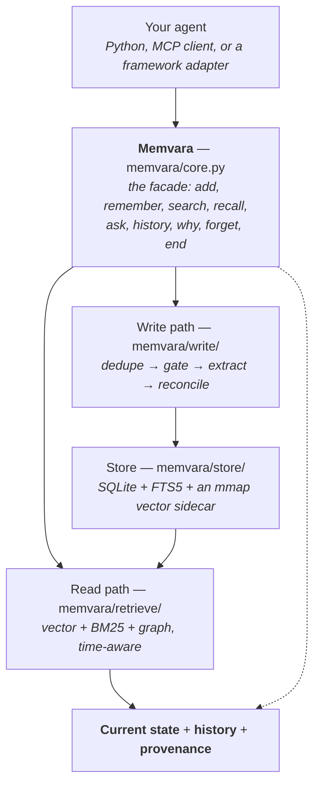
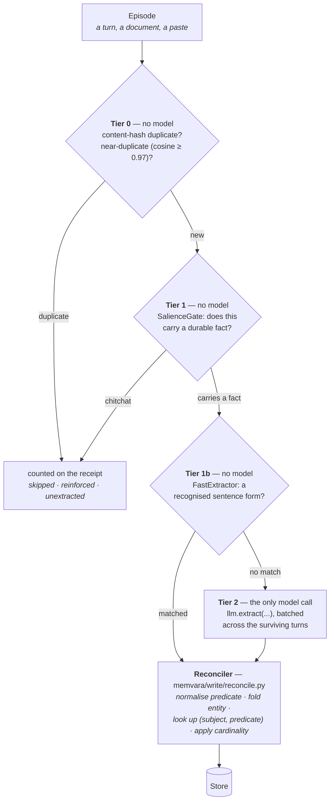
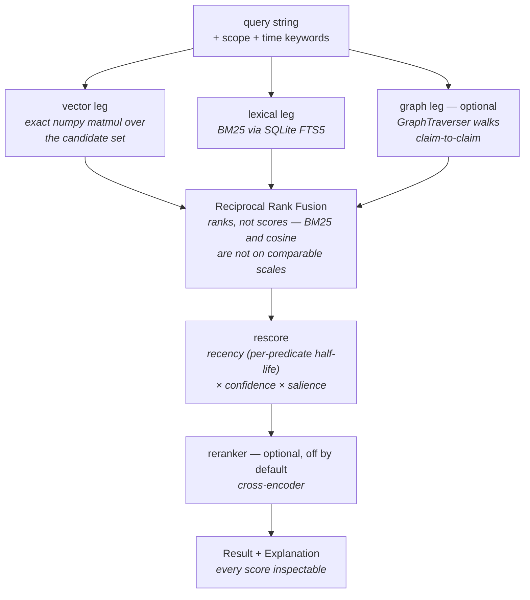
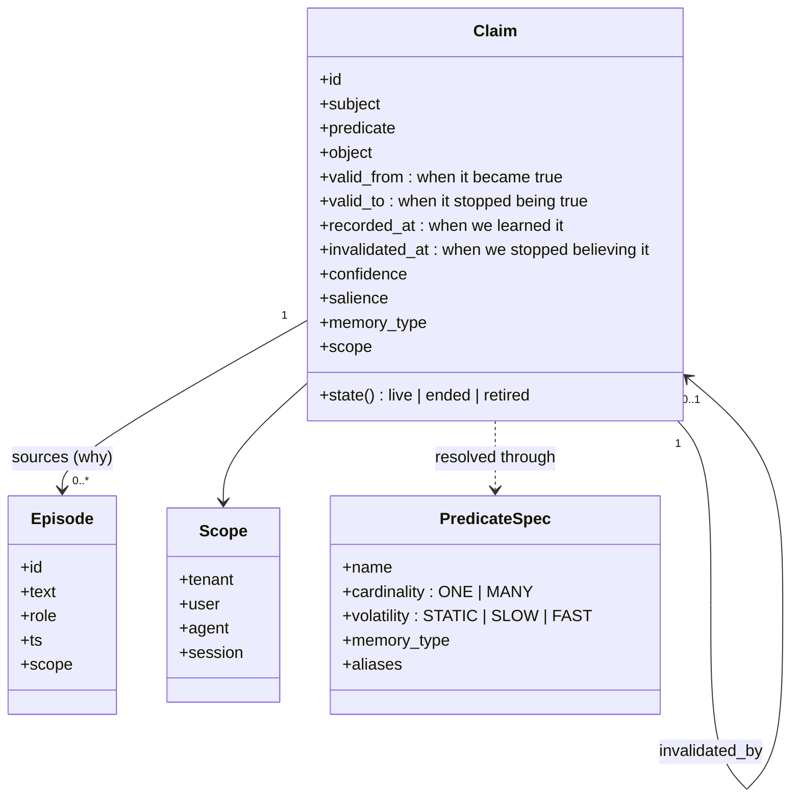

# Architecture

Four diagrams, in increasing detail. Every box below is a module in this repository —
nothing here is aspirational, and [Internals](../INTERNALS.md) is the module-by-module
contract behind it.

## The shape of it

Two things this picture is making a point of:

- **The write path and the read path meet only at the store.** Nothing on the read path
  calls a model, ever — not even the optional reranker, which is a cross-encoder rather
  than a generative model.
- **`history` and `provenance` are not a separate subsystem.** They fall out of the store
  keeping intervals and supersession pointers instead of overwriting rows.

## The write path, tier by tier

The design claim is that the model is rarely consulted. This is the mechanism, and each
tier's job is to stop a turn before it reaches the one that costs money.

With no `llm=` configured there is **no tier 2 at all**: turns that reach it are dropped
and counted on `WriteReceipt.unextracted`, and the constructor warns once. That is the
qualifier on the offline claim — the library runs with no API key; extraction from
arbitrary prose does not. `remember()` enters at the Reconciler and skips every tier
above it, which is why a real integration writing triples never needs a model.

`WriteReceipt` reports `llm_calls` on every write, so the claim is checkable rather than
asserted.

## The read path

The three time keywords are resolved **before anything else**, so `as_of` passed alongside
`valid_at` raises rather than quietly picking one. They reach the store as SQL predicates
over the four date columns, which is what makes a historical search a query rather than a
post-filter.

Decay is measured at `known_at`, not `valid_at`: recency asks how long ago we last heard
something, and that is a question about the belief clock.

## What a claim is

**The four date columns are the whole design.** `valid_from`/`valid_to` are the world
clock; `recorded_at`/`invalidated_at` are the belief clock. Which pair a write closes is
what separates *ended* from *retired* — see
[bitemporal memory](../concepts/bitemporal-memory.md#the-three-states-and-why-there-are-three).

`Scope` is hierarchical — `tenant > user > agent > session`, with inheritance — so a query
at session scope also sees that user's durable memory but never a sibling session's
scratch space. Scope filters fail **closed**: a scope that resolves to nothing matches
nothing rather than degrading into an unfiltered query.

## Where the seams are

Everything replaceable is a protocol, and each one has a real second implementation in
this repository rather than being a hypothetical extension point:

| Protocol | Default | Also in this repo |
|---|---|---|
| `Store` | `SQLiteStore` | `RemoteStore` — partial on purpose, raising where the REST facade has no endpoint |
| `Embedder` | `HashingEmbedder` (offline, lexical) | `CachedEmbedder`, `LocalEmbedder` (sentence-transformers) |
| `LLM` | `NullLLM` | `AnthropicLLM`, `OpenAILLM` |
| `Redactor` | none | `PatternRedactor` |
| `Recorder` | none | `MemoryRecorder` |

The vector index is exact and in-process — a numpy matmul over the candidate set. Correct
and fast to roughly a million claims, at which point `Store` is where pgvector or Qdrant
goes.

## What is not in this repository

The REST API and the hosted control plane are the commercial half, and that is a decision
rather than a gap — [Open core](../OPEN-CORE.md) says where the line is and why it does
not move. What *is* here is the client half, twice over: `memvara/remote/` is what an
application calls (`Memvara(api_key=…)`), and `memvara/store/remote.py` is the low-level
`Store` the local engine calls.

---

Previous: [Frameworks](../integrations/frameworks.md) · Next: [API reference](../API.md) · [FAQ](../FAQ.md)
